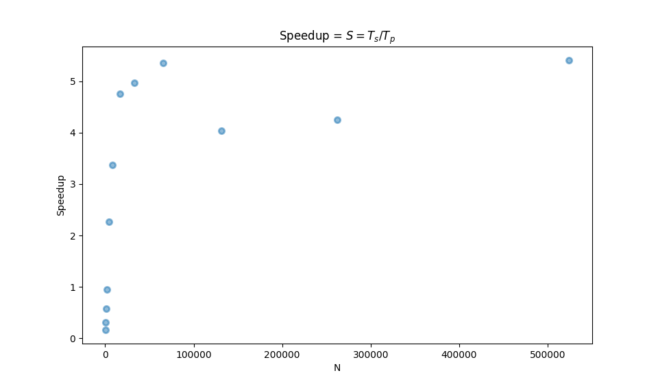
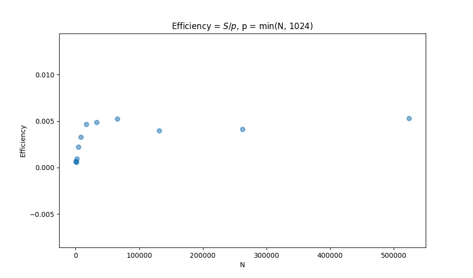

# Yet Another CUDA FFT

## Usage 

### Compiling the program

Type `make` to compile the program. Alternatively, type the following commands:

```
nvcc --compiler-options=-Wall -g -c argparse.c 
nvcc --compiler-options=-Wall -g argparse.o HugoRiveraA3.cu -o fft -lm
```

The files `argparse.h` and `argparse.c` are used for command line argument
parsing, thanks to the lightweight argparse library.


### Usage

```
$ ./fft -h
Usage: fft [options]

Compute the FFT of a dataset with a given size, using a specified DFT algorithm.

    -h, --help                show this help message and exit

Algorithm and data options
    -a, --algorithm=<str>     algorithm for computing the DFT (dft|fft|gpu|fft_gpu|dft_gpu),
                              default is 'dft'
    -f, --fill_with=<int>     fill data with this integer
    -s, --no_samples          do not set first part of array to sample data
    -N, --data_length=<int>   data length

Benchmark options
    -t, --measure_time=<int>  measure runtime. runs algorithms <int> times. set to 0 if not needed.
    -p, --no_print            do not print results

```

### Measuring runtime

Runtime is easy to measure.

```
$ ./fft --measure_time=10 --no_print -N1024 -afft
Running Cooley-Tukey FFT with N=1024
    0.00028737 (s)
    0.00027086 (s)
    0.00027070 (s)
    0.00027063 (s)
    0.00027062 (s)
    0.00027062 (s)
    0.00027062 (s)
    0.00027062 (s)
    0.00027062 (s)
    0.00027062 (s)
$ ./fft --measure_time=10 --no_print -N1024 -afft_gpu
Running Cooley-Tukey FFT on GPU with N=1024
    0.00054887 (s)
    0.00044085 (s)
    0.00044584 (s)
    0.00042513 (s)
    0.00042042 (s)
    0.00041740 (s)
    0.00041829 (s)
    0.00041808 (s)
    0.00041718 (s)
    0.00041853 (s)
```

The FFT on the GPU only starts to
outperform the FFT on the CPU on larger datasets.

```
$ ./fft --measure_time=10 --no_print -N65536 -afft
Running Cooley-Tukey FFT with N=65536
    0.02675756 (s)
    0.02649335 (s)
    0.02648379 (s)
    0.02648249 (s)
    0.02648116 (s)
    0.02648694 (s)
    0.02650917 (s)
    0.02648482 (s)
    0.02648311 (s)
    0.02648319 (s)
$ ./fft --measure_time=10 --no_print -N65536 -afft_gpu
Running Cooley-Tukey FFT on GPU with N=65536
    0.00158091 (s)
    0.00115752 (s)
    0.00116558 (s)
    0.00115046 (s)
    0.00115190 (s)
    0.00116676 (s)
    0.00114784 (s)
    0.00114956 (s)
    0.00114897 (s)
    0.00117116 (s)
```

## Performance 

In seconds
<!-- TODO (on peano) -->

| N | fft\_gpu | fft | dft\_gpu | dft |
|-----------|----------------------------------|----------------------------------|----------------------------------|----------------------------------|
|   256  |  0.00041  ± 2.7e-05 |  6.99e-05 ± 9.4e-06 |  0.0004048 ± 1.7e-05 |  0.01285 ± 0.0014 | 
|   512  |  0.00044  ± 4.2e-05 |  0.000137 ± 1.7e-07 |  0.0005946 ± 1.8e-05 |  0.04353 ± 0.0029 | 
|  1024  |  0.00048 ± 3.1e-05 |  0.000277 ± 1.2e-05 |  0.00128 ± 2.3e-05 |  0.4002 ± 0.67 | 
|  2048  |  0.00049  ± 2.7e-05 |  0.000468 ± 5.2e-06 |  0.004396 ± 0.00066 |   2.069 ± 1.0 | 
|  4096  |  0.00047  ± 1.9e-05 |  0.00108 ± 2e-05 |  0.0155 ± 0.00091 | 
|  8192  |  0.00062  ± 3.7e-05 |  0.00211 ± 6.2e-05 | 
| 16384  |  0.00095  ± 2.7e-05 |  0.00454 ± 0.00017 | 
| 32768  |  0.00185 ± 0.00032 |  0.00924 ± 0.00066 | 
| 65536  |  0.00349 ± 0.00048 |  0.0187 ± 0.0033 | 
| 131072 |  0.00763 ± 0.0019 |  0.0308 ± 0.0026 | 
| 262144 |  0.0146 ± 0.0025 |  0.0621 ± 0.0026 | 
| 524288 |  0.0253 ± 0.0028 |  0.137 ± 0.002 | 

### Speedup and Efficiency

The scripts `time.sh` and `plot.py` are used to gather and plot timing data
from multiple runs.

{width=624 height=366}

{width=624 height=366}

## Definition of the DFT 
    
Let `x` be an `N` dimensional complex vector.
Then the DFT of `x` is an `N` dimensional complex vector called `Y` where
each element of `Y` is defined as follows:

```
Y[k] = sum from n=0 to N-1 of x[n] * exp(-2i * pi * n * k / N)
```

<!-- TODO See here for intuitive explanations: -->
